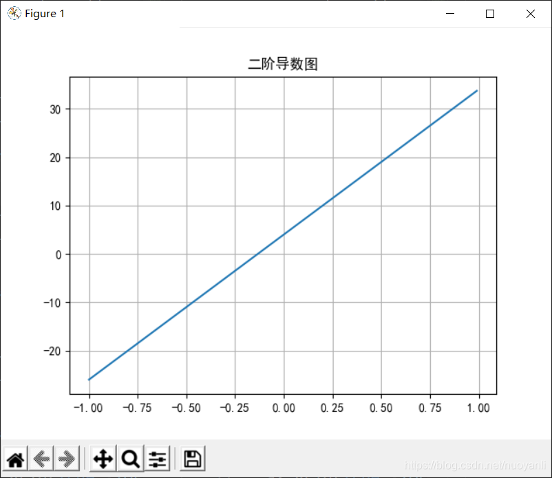
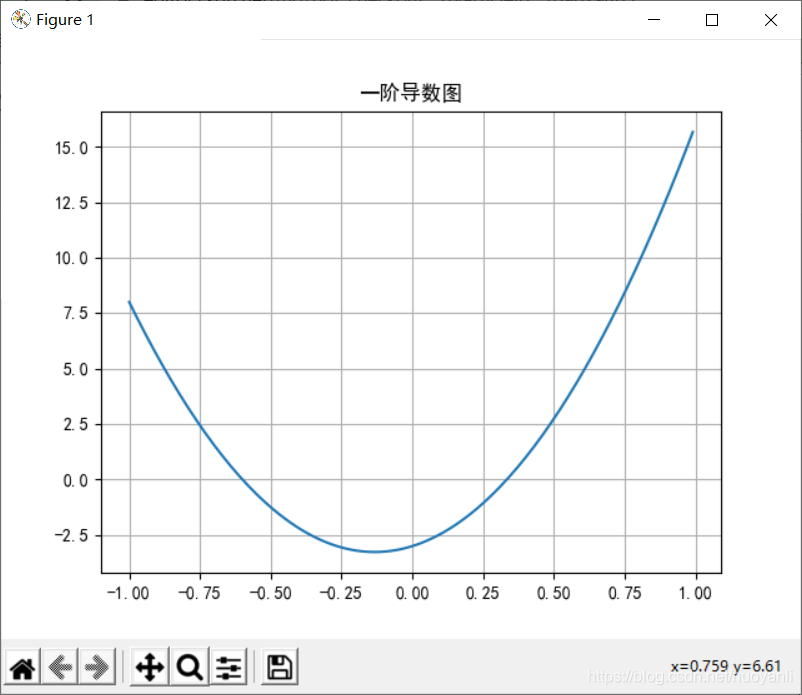
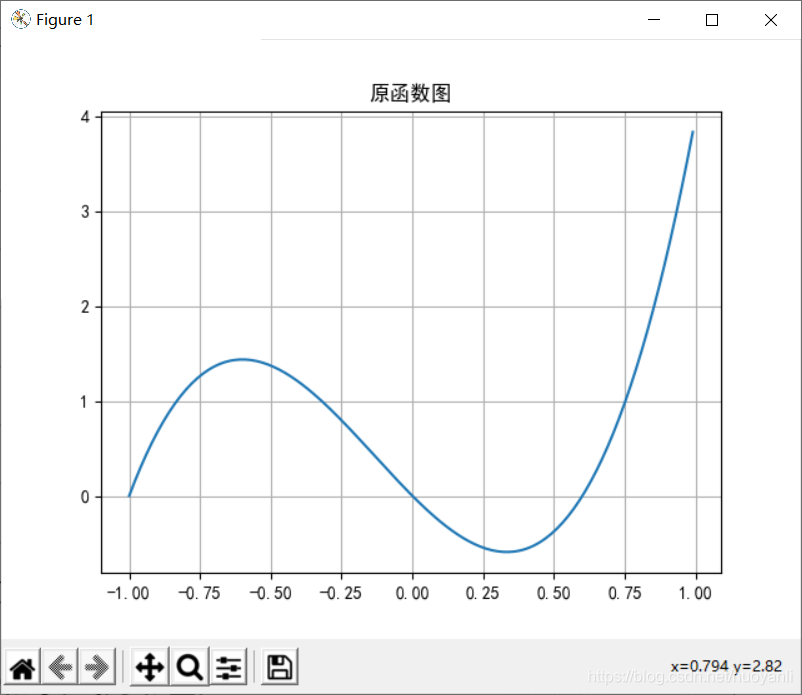
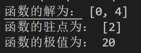
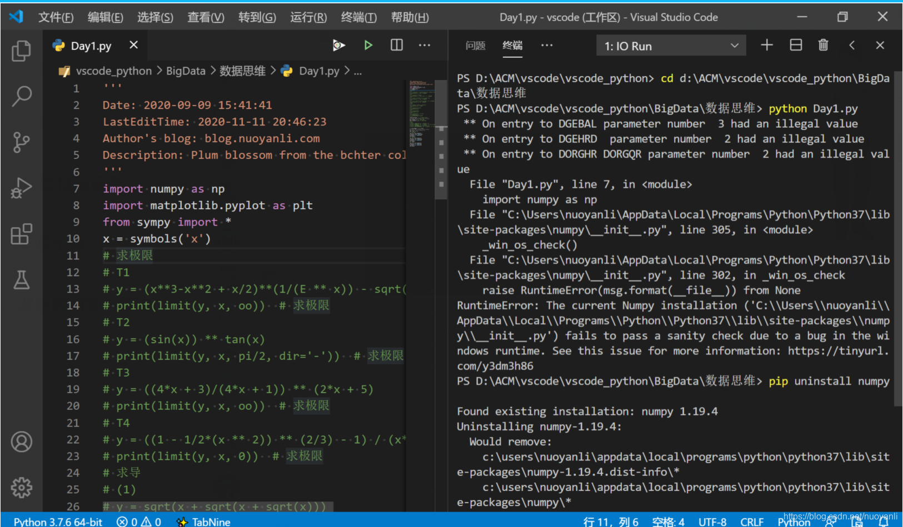
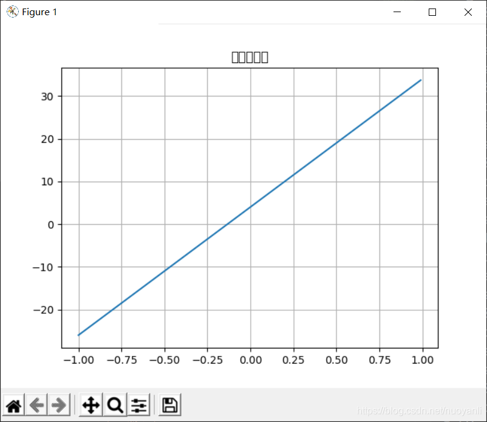

### 1.实验目的及要求

掌握微积分中常用函数及其性质。
掌握一元函数的微分与积分，包括导数的概念及各种求导法则、微分及其应用、微积分学的基本定理。

### 2.实验主要内容

1.利用Python的SymPy库中的函数求下列极限。

(1) $\lim_{x \rightarrow \infty}[ ( x^3 − x^2 + \frac{x}{2} ) e^{\frac{1}{x}}− \sqrt{x^6 + 1} ]$ 

```python
from sympy import *
x = symbols('x')
y = (x**3-x**2 + x/2)**(1/(E ** x)) - sqrt(x ** 6 + 1)
print(limit(y, x, oo))  # 求极限
#结果为：-oo
```
(2) $\lim_{x \to (\frac{π}{2})} - (sinx)^{tanx}$
```python
from sympy import *
x = symbols('x')
y = (sin(x)) ** tan(x)
print(limit(y, x, pi/2, dir='-'))  # 求极限
#结果为：1

```
(3) $\lim_{x \rightarrow \infty}(\frac{4x+3}{4x+1})^{2x+50}$
```python
from sympy import *
x = symbols('x')
y = ((4*x + 3)/(4*x + 1)) ** (2*x + 5)
print(limit(y, x, oo))  # 求极限
#结果为：E

```
(4) $\lim_{x \to 0}\frac{(1-\frac{1}{2}x^2)^\frac{3}{2}-1}{xln(1+x)}$
```python
from sympy import *
x = symbols('x')
y = ((1 - 1/2*(x ** 2)) ** (2/3) - 1) / (x*log(1 + x))
print(limit(y, x, 0))  # 求极限
#结果为：-0.333333333333333

```
2、利用Python的SymPy库中的函数求下列函数关于x的导数。

(1) $y=\sqrt{x+\sqrt{x+\sqrt{x}}}$

```python
from sympy import *
x = symbols('x')
y = sqrt(x + sqrt(x + sqrt(x)))
print(diff(y,x))  # 求导
#结果是：((1/2 + 1/(4*sqrt(x)))/(2*sqrt(sqrt(x) + x)) + 1/2)/sqrt(x + sqrt(sqrt(x) + x))    
```
(2) $y=\sqrt{\frac{x-2}{x-3}}$
```python
from sympy import *
x = symbols('x')
y = sqrt((x-2)/(x-3))
print(diff(y,x))
#结果是：sqrt((x - 2)/(x - 3))*(x - 3)*(1/(2*(x - 3)) - (x - 2)/(2*(x - 3)**2))/(x - 2)
```
(3) $y=(\frac{x}{1+x})^x$

```python
from sympy import *
x = symbols('x')
y = (x/(x+1))**x
print(diff(y,x))
#结果是:(x/(x + 1))**x*((x + 1)*(-x/(x + 1)**2 + 1/(x + 1)) + log(x/(x + 1)))

```
(4) $y=arcsin\sqrt{1-x^2}$
```python
from sympy import *
x = symbols('x')
y = asin(sqrt(1 - x ** 2))
print(diff(y,x))
#结果是：-x/(sqrt(1 - x**2)*sqrt(x**2))

```
3、设曲线$y = 5x^3 + 2 x^2 − 3x$

(1) 求曲线的单调区间及极值点。
(2) 求曲线的凹凸点区间及抛点。
```python
from sympy import *
x = symbols('x')
init_printing()  # 使公式的输出更美观
y = 5 * x  **  3 + 2 * x  **  2 - 3 * x
df = diff(y, x)  # 一阶导函数
df2 = diff(y, x, 2)  # 二阶导函数
# (1)
# 方法一
print('函数的驻点为：', solve(df, x))
# 方法二
print('二阶导数在驻点的值为：', df2.subs(x, - 3 / 5), df2.subs(x, 1 / 3))
# 极值
print('函数的极值为：', y.subs(x, - 3 / 5), y.subs(x, 1 / 3))
# (2)
print('函数的拐点为：', solve(df2, x))
print('函数在拐点的取值为：', y.subs(x, - 2 / 15))
# 画图
import numpy as np
import matplotlib.pyplot as plt
x = np.arange( - 1, 1, 0.01)
y = 5 * x  **  3 + 2 * x  **  2 - 3 * x
df = 15 * x  **  2 + 4 * x - 3
df2 = 30 * x + 4
# 二阶导数图
plt.rcParams['font.sans-serif'] = ['SimHei']#中文支持
plt.rcParams['axes.unicode_minus']=False # 用来正常显示负号
fig, ax = plt.subplots()
ax.plot(x, df2, zorder=10)
ax.grid(True, zorder=10)
plt.title('二阶导数图')
plt.show()
# 一阶导数图
fig, ax = plt.subplots()
ax.plot(x, df, zorder=10)
ax.grid(True, zorder=10)
plt.title('一阶导数图')
plt.show()
# 原函数图
fig, ax = plt.subplots()
ax.plot(x, y, zorder=10)
ax.grid(True, zorder=10)
plt.title('原函数图')
plt.show()

```




4 、 将一个球垂直上拋，它的高度 h 与时间 t 的关系式为 h = 5 t ( 4 − t ) ，则球达到的最大高度是多少。
```python
from sympy import *
t = symbols('t')
h = 5 * t * (4 - t)
print('函数的解为：', solve(h, t))
df = diff(h, t)  # 一阶导函数
print('函数的驻点为：', solve(df, t))
print('函数的极值为：', h.subs(t, 2))
```

即最大高度是20

5、利用 Python 的 SymPy 库中的函数计算下列不定积分。

(1) $\int\frac{sinx}{1+sinx+cosx}dx$

```python
from sympy import *
x = symbols('x')
f = sin(x) / (1 + sin(x) + cos(x))
print(integrate(f, x))  # 求不定积分
#结果是：x/2 - log(tan(x/2) + 1) + log(tan(x/2)**2 + 1)/2

```
(2) $\int\frac{1}{x}\sqrt{\frac{1+x}{x}}dx$

```python
from sympy import *
x = symbols('x')
f = 1 / ((x  **  2) * sqrt(x  **  2 + 1))
print(integrate(f, x))  # 求不定积分
#结果是：-sqrt(1 + x**(-2))
```
(3) $\int\frac{x^\frac{2}{3}\sqrt{x}+\sqrt[5]{x}}{\sqrt{x}}dx$

```python
from sympy import *
x = symbols('x')
f = (x  **  (2 / 3) * sqrt(x) + x  **  (1 / 5)) / sqrt(x)
print(integrate(f, x)) # 求不定积分
#结果是：1.42857142857143*x**0.7 + 0.6*x**1.66666666666667
```

(4) $\int e^{2x}sin3x dx$

```python
from sympy import *
x = symbols('x')
f = exp(2 * x) * sin(3 * x)
print(integrate(f, x))  # 求不定积分
#结果是：2*exp(2*x)*sin(3*x)/13 - 3*exp(2*x)*cos(3*x)/13
```

6、利用 Python 的 SymPy 库中的函数计算下列定积分。

(1) $\int^{π}_{0}(1-sin^3x)dx$

```python
from sympy import *
x = symbols('x')
f = 1 - (sin(x))  **  3
print(integrate(f, (x, 0, pi)))  # 求定积分
# 结果是：-4/3 + pi
```
(2) $\int^{0}_{-2}\frac{x+2}{x^2+2x+2}dx$

```python
from sympy import *
x = symbols('x')
f = (x + 2) / (x  **  2 + 2 * x + 2)
print(integrate(f, (x, - 2, 0)))  # 求定积分
#结果是：pi/2
```
(3) $\int^{e}_{1}sin(lnx)dx$

```python
from sympy import *
x = symbols('x')
f = sin(log(x))
print(integrate(f, (x, 1, exp(1))))  # 求定积分
#结果是：-E*cos(1)/2 + 1/2 + E*sin(1)/2
```
(4) $\int^{1}_{0}e^{\sqrt{x}}dx$

```python
from sympy import *
x = symbols('x')
f = exp(sqrt(x))
print(integrate(f, (x, 0, 1)))  # 求定积分
#结果是：2
```
### 3.实验仪器设备
略

### 4.实验步骤
略

### 5.遇到的问题与解决办法

1：numpy报错，版本问题


解决办法卸载numpy1.94安装numpy1.94：参考链接：https://blog.csdn.net/qq_34530696/article/details/109531406

2：plt绘图，中文和负号显示错误

添加：
```python
plt.rcParams['font.sans-serif'] = ['SimHei']#中文支持
plt.rcParams['axes.unicode_minus']=False # 用来正常显示负号
```