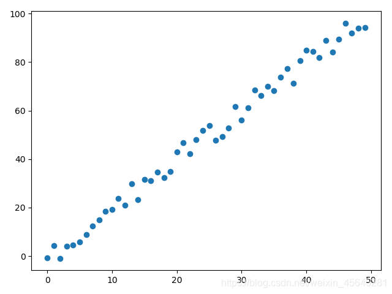
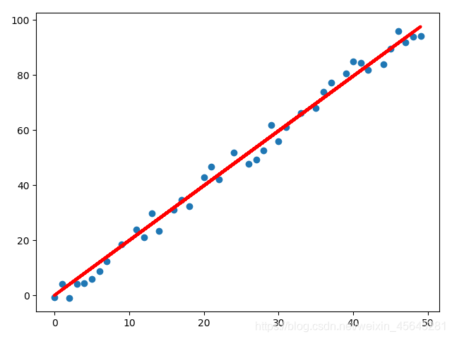
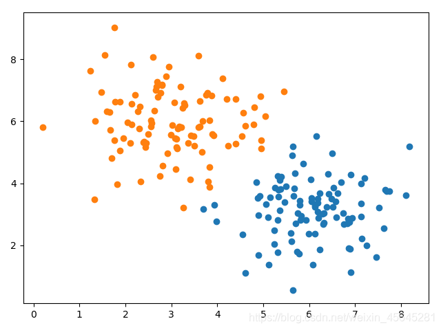
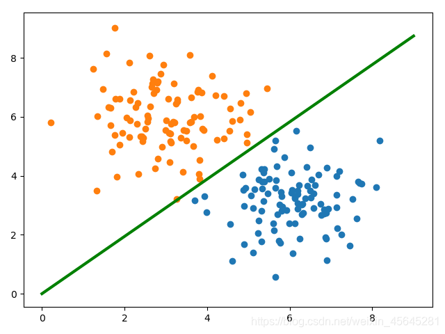

### 机器学习-梯度下降法（SGD+BGD+MBGD）

<p>SGD：随机梯度下降在每次更新的时候，只考虑了一个样本点，这样会大大加快训练数据，也恰好是批梯度下降的缺点，因为不一定每次都朝着梯度下降的方向。<br>
BGD：批量梯度下降每次更新都使用了所有的样本数据，朝着最小值迭代运动的，缺点就是速度很慢。<br>
MBGD：综合批量梯度下降法和随机梯度下降法的优点。</p>

线性回归
这里只是测试了一元线性回归，还有多元线性回归。

初始数据集是：y = 2 * x + 随机噪声



```python
import numpy as np
import matplotlib.pyplot as plt
from sklearn.linear_model import LinearRegression

#####   产生数据集   #####
x = np.arange(0,50)
np.random.seed(1)
#添加50个随机噪声,范围[-5,5]
random_array=(np.random.random(50)*2-1)*5
y = 2 * x + random_array

#转换二维数组
x=x.reshape(50,1)
y=y.reshape(50,1)
data=np.concatenate((x,y),axis=1)
plt.scatter(x,y)
plt.show()

def ML():
    ##### 机器学习模块调用 #####
    # 训练模型
    lr = LinearRegression()
    lr.fit(x, y)
    # 绘制数据散点图和拟合直线
    plt.scatter(x, y)
    plt.plot(x, lr.predict(x), color='red', linewidth=3)
    plt.show()

def SGD():
    NUM=1        #标记
    N = 1000     #最大循环次数
    epsilon = 190  #误差阈值
    theta = np.random.rand()  # 线性模型的系数
    learning_rate = 0.001        # 学习率
    #x = np.hstack([np.ones((50,1)),x])  # 增加全1列
    np.random.shuffle(data)
    #训练集与测试集
    train_data=data[:40]
    test_data=data[40:]

    #存放数据列表
    theta_list=[]
    loss_list=[]

    while True:
        np.random.shuffle(train_data)
        for n in range(N):
            #取随机样本
            randint = np.random.randint(0,40)
            temp_x = train_data[randint][0]
            temp_y = train_data[randint][1]
            #计算梯度
            grad = temp_x * (temp_x * theta - temp_y)
            theta = theta - learning_rate*grad
        x=train_data[:,0]
        y=train_data[:,1]
        loss=np.sum(0.5*(theta*x-y)**2)
        theta_list.append(theta)
        loss_list.append(loss)
        NUM=NUM+1
        print("num: %d ,theta: %s ,loss: %s "%(NUM,theta,loss))
        if loss<epsilon:
            break

    plt.scatter(x,y)
    plt.plot(x,x*theta,color='red',linewidth=3)
    plt.show()

def BGD():
    NUM = 1  # 标记
    N = 100  # 最大循环次数
    theta = np.random.rand()  # 线性模型的系数
    learning_rate = 0.001  # 学习率
    for i in range(N):
        pred_y = np.dot(x,theta)
        loss = pred_y - y
        # 计算梯度
        grad = np.dot(x.T,loss)/x.shape[0]
        # 更新theta
        theta = theta - learning_rate*grad
        sum_loss=np.sum(pred_y - y)
        NUM = NUM + 1
        # 输出当前的更新次数和误差
        print("num: %d ,theta: %s ,sum_loss: %s " % (NUM, theta, sum_loss))
    # 绘制拟合的曲线
    plt.scatter(x,y)
    plt.plot(x,x*theta,color='green',linewidth=3)
    plt.show()

def MBGD():
    N = 200  # 最大循环次数
    theta = np.random.rand()  # 线性模型的系数
    learning_rate = 0.001  # 学习率
    epsilon = 20  # 误差阈值
    # 还原参数theta，其他参数复用梯度下降
    #theta = np.random.rand(2,1)
    # 指定每次更新使用的数据量
    batch_size = 20
    for i in range(N):
        # 随机样本的列索引
        indexs = np.random.randint(0, x.shape[0], size=batch_size)
        # 随机样本
        temp_x = x.take(indexs, axis=0)
        temp_y = y.take(indexs, axis=0)
        # 计算梯度
        grad = np.dot(temp_x.T, (np.dot(temp_x, theta) - temp_y)) / temp_x.shape[0]
        # 更新theta
        theta = theta - learning_rate * grad
        # 计算更新后的误差
        error = np.linalg.norm(np.dot(x, theta) - y)
        # 输出当前的更新次数和误差
        print("number is %d.  error is %f"%(i,error))
        # 误差小于阈值时退出循环
        print("thema: %s"%(theta))
        if error < epsilon:
            break

    # 绘制拟合的曲线
    plt.scatter(x, y)
    plt.plot(x, np.dot(x, theta), color='red', linewidth=3)
    plt.show()

if __name__=="__main__":
    #SGD()
    #BGD()
    MBGD()
```
结果：


逻辑回归<br>
原始数据集：

```python
import numpy as np
import matplotlib.pyplot as plt


##### 产生数据集 #####
# y = w1*x1 + w2*x2
np.random.seed(1)
#高斯模型
x_1 = np.random.normal(6,1,size=100)
x_2 = np.random.normal(3,1,size=100)
y=np.ones(100)
c0 = np.array([x_1,x_2,y]).T

x_1 = np.random.normal(3,1,size=100)
x_2 = np.random.normal(6,1,size=100)
y=np.zeros(100)
c1 = np.array([x_1,x_2,y]).T

#将数据整合
all_data=np.vstack((c0,c1))
#数据打乱
np.random.shuffle(all_data)

#训练集和测试集
train_data_x=all_data[:150,:2]
train_data_y=all_data[:150,-1]
test_data_x=all_data[150:,:2]
test_data_y=all_data[150:,-1]

w = np.random.rand(2,1)

def loss_data(y,pred_y):
    return -np.mean( y*np.log(pred_y) + (1-y)*np.log(1-pred_y))

def sigmod(z):
    return 1/(1+np.exp(-z))

learn_rate=0.001    #学习率
loss_list=[]
for i in range(1000):
    pred_y=sigmod( np.dot(w.T,train_data_x.T))
    loss=loss_data(train_data_y,pred_y)
    #计算梯度
    grad = -np.mean(train_data_x*(train_data_y-pred_y).T,axis=0)
    w = w - (learn_rate*grad).reshape(2,1)
    loss_list.append(loss)
    if i%10 ==1:
        print("i: %d,loss: %f"%(i,loss))
    if loss<0.1:
        break

#绘制结果图
plt.scatter(c0[:, 0], c0[:, 1])
plt.scatter(c1[:, 0], c1[:, 1])
x=np.arange(10)
#w1*x+w2*y=0
y=-(w[0]*x)/w[1]
plt.plot(x,y)
plt.show()

#测试
pred_y=np.dot(w.T,test_data_x.T)
yy=np.array(pred_y>0,dtype=int).flatten()
rate=np.sum(test_data_y==yy)/len(yy)
print(rate)
```

结果：

