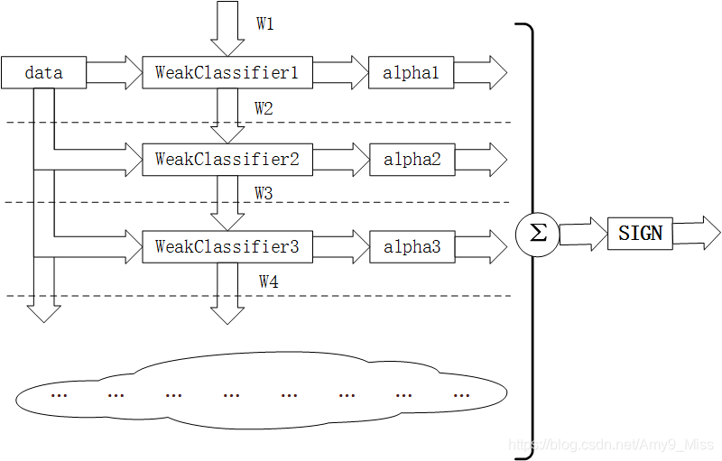
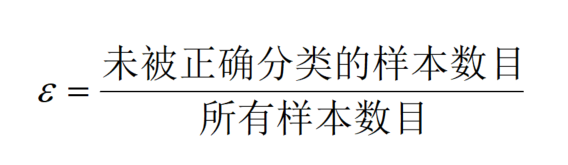
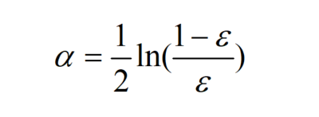
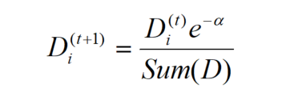
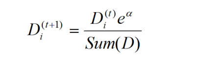

###1. 基于数据集多重抽样的分类器
将不同的分类器组合起来，称为集成算法（ensemble method） 或者 元算法（meta-algorithm）。使用集成算法会有多种形式：可以是不同算法的集成，也可以是同一算法在不同设置下的集成，还可以是数据集不同部分分配给不同分类器之后的集成。常用的是基于同一种分类器多个不同实例的两种计算方法。

bagging: 基于数据随机重抽样的分类器构建方法
自举汇聚法（bootstrap aggregating）,也称bagging方法，是在从原始数据集中选择S次后得到S个新胡书记的一种技术。新数据集合原数据大小相等。每个数据集都是通过在原数据集中有放回抽样随机选择一个样本来进行替换得到的。这里的替换意味着可以多次地选择同一样本。这一性质就允许新数据集中可以有重复的值，而原始数据集的某些值在新集合中则不再出现。

在S个数据集建好之后，将某个学习算法分别作用于每个数据集就得到了S个分类器。当要对新数据进行分类时，就可以应用这S个分类器进行分裂。与此同时，选择分类器投票结果中最多的类别作为最后的分类结果。

bagging方法中最流行的版本是随机森林（random forest）。

boosting
boosting 是一种与bagging很类似的技术。不论是在boosting还是bagging中，所使用的多个分类器的类型都是一致的。但是前者当中，不同分类器是通过串行训练而获得的，每个新分类器都根据已训练处的分类器的性能来进行训练。boosting是通过集中关注被已有分类器分错的那些数据来获得新的分类器。

由于boosting分类的结果是基于所有分类器的加权求和结果的，因此boosting与bagging不太一样。bagging中的分类器权重是相等的，而boosting中的分类器权重并不相等，每个权重代表的是其对对应分类器在上一轮迭代中的成功度。

boosting方法中最流行的版本是AdaBoost。

###2. 训练：基于错误提升分类器的性能
AdaBoost原理
Adaboost是Adaptive boosting（自适应boosting）的缩写，基本原理就是将多个弱分类器（弱分类器一般选用单层决策树）进行合理的结合，使其成为一个强分类器。

Adaboost采用迭代的思想，每次迭代只训练一个弱分类器，训练好的弱分类器将参与下一次迭代的使用。也就是说，在第N次迭代中，一共就有N个弱分类器，其中N-1个是以前训练好的，其各种参数都不再改变，本次训练第N个分类器。其中弱分类器的关系是第N个弱分类器更可能分对前N-1个弱分类器没分对的数据，最终分类输出要看这N个分类器的综合效果。
 

####AdaBoost运行过程

训练数据中的每个样本，并赋予其一个权重，这些权重构成了向量D。一开始，这些权重都初始化成相等值。首先在训练数据上训练一个弱分类器并计算该分类器的错误率，然后在同一数据集上再次训练弱分类器。在分类器的第二次训练当中，将会重新调整每个样本的权值，其中第一次分对的样本的权重将会降低，而第一次分错的样本的权重将会提高。为了从所有弱分类器中得到最终的分类结果，AdaBoost为每个分类器都分配了一个权重alpha,这些alpha值是基于每个弱分类器的错误率进行计算的。其中，错误率ε \varepsilonε定义为：
 

而alpha的计算公式如下
 

计算出alpha值之后，可以对权重向量D进行更新，以使得那些正确分类的样本的权值降低而错分样本的权值升高。D的计算方法如下：

如果某个样本被正确分类，则该样本的权重更改为：
 

如果某个样本被错分，则该样本的权重更改为：
 

在计算出D之后，AdaBoost又开始下一轮迭代。AdaBoost算法会不断地重复训练和调整权值的过程，直到训练错误率为0或者弱分类器的数目达到用户指定值为止。

###3. 基于单层决策树构建弱分类器
单层决策树（decision stump, 也称决策树桩）是一种简单的决策树，它仅基于单个特征来做决策。由于这棵树只有一次分裂过程，因此它实际上就是树桩。

单层决策树构建的伪代码如下：
```python
将最小错误率minError设为+∞
对数据集中的每个特征（第一层循环）：
 对每个步长（第二层循环）：
 对每个不等号（第三层循环）：
 建立一个单层决策树并利用加权数据集对它进行测试
 如果错误率地域minError，则将当前单层决策树设置为最佳单层决策树
返回最佳单层决策树
```

####python实现
```python
from numpy import *

def loadSimpData():
    """
    构造一个简单数据集
    :return: 数据集，标签
    """
    dataMat = matrix([[1.0,2.1],
                      [2.,1.1],
                      [1.3,1.],
                      [1.,1.],
                      [2.,1.]])
    classLabels = [1.0,1.0,-1.0,-1.0,1.0]
    return dataMat, classLabels

def stumpClassify(dataMatrix,dimen,threshVal,threshIneq):
    """
    通过阈值比较对数据进行分类
    :param dataMatrix: 数据集
    :param dimen: 维度
    :param threshVal: 阈值
    :param threshIneq: 不等号
    :return:类别估计数组
    """
    retArray = ones((shape(dataMatrix)[0],1))
    if threshIneq == 'lt':  # lt:表示小于等于号
        retArray[dataMatrix[:,dimen]<=threshVal] = -1.0
    else:
        retArray[dataMatrix[:,dimen]>threshVal] = -1.0
    return retArray

def buildStump(dataArr,classLabels,D):
    """
    找到数据集上最佳的单层决策树
    :param dataArr:数据集
    :param classLabels:标签
    :param D:权重向量
    :return:最佳单层决策树相关信息字典、错误率、类别估计值
    """
    dataMatrix = mat(dataArr)
    labelMat = mat(classLabels).T
    m,n = shape(dataMatrix)
    numSteps = 10.0
    bestStump = {}  # 存储给定权重向量D时所得到的最佳单层决策树相关信息
    bestClasEst = mat(zeros((m,1)))  # 最佳类别估计值
    minError = inf  #初始化最小错误率为正无穷大
    for i in range(n):  # 循环所有特征
        rangeMin = dataMatrix[:,i].min()
        rangeMax = dataMatrix[:,i].max()
        stepSize = (rangeMax-rangeMin)/numSteps
        for j in range(-1,int(numSteps)+1):  # 循环每个步长
            for inequal in ['lt','gt']:  # 循环每个不等号，即大于和小于之间切换
                # 阈值可以设置为整个取值范围之外
                threshVal = (rangeMin+float(j)*stepSize)  # 阈值
                predictedVals = stumpClassify(dataMatrix,i,threshVal,inequal) # 预测的分类结果
                errArr = mat(ones((m,1)))  # 错误向量
                errArr[predictedVals==labelMat] = 0  # 预测值和真实值相等时，设置为0
                weightedError = D.T*errArr  # 权重错误率
                print("split: dim %d, thresh %.2f, thresh inequal: %s, the weighted error is %.3f" %(i,threshVal,inequal,weightedError))
                # 当权重错误率小于最小错误率时，更新最小错误率、最佳决策树相关信息、类别估计值
                if weightedError<minError:
                    minError = weightedError
                    bestClasEst = predictedVals.copy()
                    bestStump['dim'] = i  # 维度
                    bestStump['thresh'] = threshVal # 阈值
                    bestStump['ineq'] = inequal  # 不等号
    return bestStump,minError,bestClasEst
```

输入如下代码，运行：
```python
dataMat,classLabels = loadSimpData()
D = mat(ones((5,1))/5)
bestStump, minError, bestClasEst = buildStump(dataMat,classLabels,D)
print("最佳单层决策树相关信息：",bestStump)
print("最小错误率: ",minError)
print("预测的类别结果:",bestClasEst.T)
```

运行结果如下：
```python
split: dim 0, thresh 0.90, thresh inequal: lt, the weighted error is 0.400
split: dim 0, thresh 0.90, thresh inequal: gt, the weighted error is 0.600
split: dim 0, thresh 1.00, thresh inequal: lt, the weighted error is 0.400
split: dim 0, thresh 1.00, thresh inequal: gt, the weighted error is 0.600
split: dim 0, thresh 1.10, thresh inequal: lt, the weighted error is 0.400

…

split: dim 1, thresh 2.10, thresh inequal: lt, the weighted error is 0.600
split: dim 1, thresh 2.10, thresh inequal: gt, the weighted error is 0.400
最佳单层决策树相关信息： {‘dim’: 0, ‘thresh’: 1.3, ‘ineq’: ‘lt’}
最小错误率: [[0.2]]
预测的类别结果: [[-1. 1. -1. -1. 1.]]
```

###4. 完整AdaBoost算法实现
整个实现伪代码如下：
```python
对每次迭代：
 利用buildStump()函数找到最佳的单层决策树
 将最佳单层决策树加入到单层决策树数组
 计算alpha
 计算新的权值向量D
 更新累计类别估计值
 如果错误率等于0.0，则退出循环
```
####python实现
在上一节的代码中，为了减少输出展示的内容，可以注释掉buildStump()中的print语句【也可以不注释】，并追加如下代码

```python
def adaBoostTrainDS(dataArr,classLabels,numIt=40):
    """
    基于单层决策树的AdaBoost训练过程
    :param dataArr: 数据集
    :param classLabels: 标签
    :param numIt: 迭代次数
    :return:多个弱分类器，包含其对应的alpha值
    """
    weakClassArr = [] # 单层决策树数组
    m = shape(dataArr)[0]
    # D为每个数据点的权重，每个数据点的权重都会被初始化为1/m
    D = mat(ones((m,1))/m)
    aggClassEst = mat(zeros((m,1)))  # 记录每个数据点的类别估计累计值
    for i in range(numIt):
        # 构建一个最佳单层决策树
        bestStump,error,classEst = buildStump(dataArr,classLabels,D)
        print("D: ",D.T)
        # max(error,1e-16)))用于确保在没有错误时不会发生除零溢出
        # alpha:本次单层决策树输出结果的权重
        alpha = float(0.5*log((1.0-error)/max(error,1e-16)))  # 计算alpha
        bestStump['alpha'] = alpha
        weakClassArr.append(bestStump) # 将最佳单层决策树存储到单层决策树数组中
        print("classEst: ",classEst.T)
        # 更新数据样本权值D
        expon = multiply(-1*alpha*mat(classLabels).T,classEst)
        D = multiply(D,exp(expon))
        D = D/D.sum()
        # 更新累计类别估计值
        aggClassEst +=alpha*classEst
        print ("aggClassEst: ",aggClassEst.T)
        # 计算错误率
        aggErrors = multiply(sign(aggClassEst)!= mat(classLabels).T,ones((m,1)))
        errorRate = aggErrors.sum()/m
        print ("total error: ",errorRate)
        # 如果错误率为0.0，则退出循环
        if errorRate==0.0:
            break
    return weakClassArr
```

输入如下代码
```python
dataMat,classLabels = loadSimpData()
D = mat(ones((5,1))/5)
classifierArr = adaBoostTrainDS(dataMat,classLabels,9)
print("classifierArr:\n",classifierArr)
```

运行结果如下：
```python
D: [[0.2 0.2 0.2 0.2 0.2]]
classEst: [[-1. 1. -1. -1. 1.]]
aggClassEst: [[-0.69314718 0.69314718 -0.69314718 -0.69314718 0.69314718]]
total error: 0.2
D: [[0.5 0.125 0.125 0.125 0.125]]
classEst: [[ 1. 1. -1. -1. -1.]]
aggClassEst: [[ 0.27980789 1.66610226 -1.66610226 -1.66610226 -0.27980789]]
total error: 0.2
D: [[0.28571429 0.07142857 0.07142857 0.07142857 0.5 ]]
classEst: [[1. 1. 1. 1. 1.]]
aggClassEst: [[ 1.17568763 2.56198199 -0.77022252 -0.77022252 0.61607184]]
total error: 0.0
classifierArr:
[{‘dim’: 0, ‘thresh’: 1.3, ‘ineq’: ‘lt’, ‘alpha’: 0.6931471805599453}, {‘dim’: 1, ‘thresh’: 1.0, ‘ineq’: ‘lt’, ‘alpha’: 0.9729550745276565}, {‘dim’: 0, ‘thresh’: 0.9, ‘ineq’: ‘lt’, ‘alpha’: 0.8958797346140273}]
```

###5. 测试算法：基于AdaBoost的分类
一旦拥有了多个弱分类器以及其对应的alpha值，就可以进行测试了。需要做的就是将弱分类器的训练过程从程序中抽出来，然后应用到某个具体的实例上。每个弱分类器的结果以其对应的alpha值作为权重。所有这些弱分类器的结果加权求和就得到了最后的结果。

####python实现
为了减少输出展示的内容，可以注释掉上面adaBoostTrainDS()中的print语句【也可以不注释】，并追加如下代码
```python
def adaClassify(datToClass,classifierArr):
    """
    利用训练出的多个弱分类器，在测试集上进行分类预测
    :param datToClass:一个或多个待分类样例
    :param classifierArr:多个弱分类器组成的数组
    :return:预测的类别值
    """
    dataMatrix = mat(datToClass)
    m = shape(dataMatrix)[0]
    aggClassEst = mat(zeros((m,1)))  # 类别估计值
    for i in range(len(classifierArr)):  # 遍历每个分类器
        # 对每个分类器得到一个类别估计值
        classEst = stumpClassify(dataMatrix,classifierArr[i]['dim'],classifierArr[i]['thresh'],classifierArr[i]['ineq'])
        aggClassEst += classifierArr[i]['alpha']*classEst
        print (aggClassEst)
    return sign(aggClassEst) # 如果aggClassEst>0,则返回1，如果aggClassEst<=0,则返回-1
```

输入如下代码
```python
dataMat,classLabels = loadSimpData()
D = mat(ones((5,1))/5)
classifierArr = adaBoostTrainDS(dataMat,classLabels,9)  # 得到弱分类器数组
print("预测[0,0]的类别结果:\n",adaClassify([0,0],classifierArr))
print("预测[[5,5],[0, 0]]的类别结果:\n",adaClassify([[5,5],[0, 0]], classifierArr))
```

运行结果如下
```python
预测[0,0]的类别结果:
[[-0.69314718]]
[[-1.66610226]]
[[-2.56198199]]
[[-1.]]
预测[[5,5],[0, 0]]的类别结果:
[[ 0.69314718]
[-0.69314718]]
[[ 1.66610226]
[-1.66610226]]
[[ 2.56198199]
[-2.56198199]]
[[ 1.]
[-1.]]
```

###6. 在一个难数据集上应用AdaBoost
基于马疝病数据集，应用AdaBoost算法，来预测患有马疝病的马是否能够存活。这里的类别标签需要是1和-1。需要对现有文件数据进行加载，并处理类别标签，具体代码如下：

为了减少输出展示的内容，可以注释掉上面adaClassify()中的print语句【也可以不注释】，将如下代码追加到现有代码中。
```python
def loadDataSet(filename):
    """
    自适应加载马疝病数据集
    :param filename:文件名
    :return:数据集合，标签
    """
    numFeat = len(open(filename).readline().split(' '))  # 获取数据的特征数
    dataMat = []
    labelMat = []
    fr = open(filename)
    for line in fr.readlines():
        lineArr = []
        curLine = line.strip().split(' ')
        for i in range(numFeat-1):
            lineArr.append(float(curLine[i]))
        dataMat.append(lineArr)
        # 将类别标签由原来的1和2转换为1和-1
        if int(curLine[-1])==1:
            labelMat.append(1.0)
        else:
            labelMat.append(-1.0)
    return dataMat,labelMat
```

输入如下脚本，进行运行：
```python
dataArr,labelArr = loadDataSet('horseColicTrain1.txt')
classifierArray = adaBoostTrainDS(dataArr,labelArr,10)
testArr,testLabelArr = loadDataSet('horseColicTest1.txt')
prediction10 = adaClassify(testArr,classifierArray)
errArr = mat(ones((len(testArr),1)))
errorNum = errArr[prediction10!=mat(testLabelArr).T].sum()
print("errorNum: ",errorNum)
print("errorRate: ",errorNum/float(len(testArr)))
```

运行结果如下：
```python
errorNum: 12.0
errorRate: 0.17647058823529413
```

之前用逻辑回归得到的平均错误率是0.34，而采用AdaBoost得到错误率只有0.17，错误率大幅降低。

###总结
集成方法通过组合多个分类器的分类结果，获得了比简单分类器更好的分类结果。多个分类器组合可能会进一步凸显单分类器的不足，比如过拟合问题。

本文介绍了两种集成方法bagging和boosting。在bagging中，是通过随机抽样的替换方式，得到了与袁术局级规模一样的数据集。而boosting在bagging的思想上更进了一步，它在数据集上顺序应用了多个不同的分类器。

boosting中最流程的一个算法是AdaBoost。AdaBoost以弱分类器作为基分类器，并且输入数据，使其通过权重向量进行加权。在第一次迭代当中，所有数据都等权重。但是在后续的迭代中，前次迭代中分错的数据的权重会增加。这种针对错误的调节能力是AdaBoost的长处。

AdaBoost算法非常强大，它能够快速处理其他分类器很难处理的数据集。

###相关链接

书籍：周志华的《机器学习实战》

视频：吴恩达的《机器学习》


