###概率
我们来具体实现这两个例子——

####1.抛硬币问题

我们先来做一个熟悉的扔硬币的试验，我们记录下正面朝上和负面朝上的次数，分别做10次、100次、1000次、10000次。刚开始正面朝上和负面朝上的次数差别较大，随着次数的增多，二者的数量趋近相等，正面朝上的概率接近50%。当然我们不可能真的扔那么多次硬币，我们让程序来实现这个过程。

python程序：

```python
import random
def coin_head_sum(n):  #正面朝上的次数
    sum = 0
    for i in range(0,n):  #执行n次
        if random.random() > 0.5:
            sum += 1
    return sum

n = 10000   #n分别取10次、100次、1000次、10000次
print (coin_head_sum(n)/n)
```

统计表：
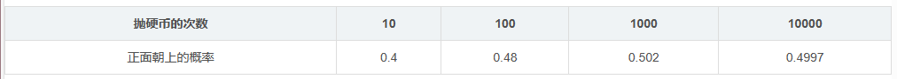 

从统计结果中可以看出，随着抛硬币次数的增加，正面朝上的概率越来越近预期结果0.5。

####2.三扇门问题

三扇门（蒙提霍尔问题）问题描述：有三扇门，其中只有一扇门是正确的选项，打开后将能获得大奖——一辆高档豪车。另外两扇门是错误选项，门内只有山羊，从门外无法获知哪一扇门才是正确选项。
 

挑战者需要从三扇门中选择一扇门打开，在决定选择某扇门后，还剩两个选项，其中至少有一个是错误的选项。此时，主持人打开了一个没被选中的门中错误的选项，让挑战者确认门中的山羊后，询问：“是否要重新选择？”挑战者是否应当重选，还是应该坚持最初的选择？或者两种做法没有什么区别？

答案也很简单：挑战者在第一次选择时，有1/3的概率正确，有2/3的概率不正确。那么主持人排除了一个错误选项后，是否应该重新选择呢？我们来分析一下这两种情况：

1.若第一次选择是正确选项，那么重选是错误选项

2.若第一次选择是错误选项，那么重选是正确选项

也就是说，重选是正确选项的概率与第一次选择是错误选项的概率相同，即重选是正确选项的概率是2/3，因此应该重选。我们用python来实现一下这个过程——

python程序：
```python
import random
def three_doors():
    doors = [1,2,3]	#三个门分别为1、2、3 ，其中3是中奖门，其他是未中奖门，当门被选中时，会从doors序列中移除。
    random.shuffle(doors)  #将doors序列随机打乱
    my_choice = doors[0]   
    if my_choice == 3:  #自己开始时正好选中大奖
        doors.remove(3)  #自己选的从doors序列中移除
        host_choice = random.choice((1,2))  #主持人从两个未中奖的门里选一个
        doors.remove(host_choice)  #主持人选的从doors序列中移除
    else:  
        #my_choice = random.choice((1,2))   ##自己开始时未选中大奖.选中的是1 or 2
        doors.remove(1)  #随后主持人会选中剩下的那个未中奖的门
        doors.remove(2)	
    return my_choice,doors
```

```python
no_election_sum = 0  #不重选中奖的次数
re_election_sum = 0  #重选中奖的次数

no_election_p = 0  #不重选中奖的概率
re_election_p = 0  #重选中奖的概率

n = 10000  #执行次数
for i in range (0,n):
    my_choice,doors = three_doors()
    #print("my_choice",my_choice," doors",doors[0])
    if my_choice == 3:
        no_election_sum += 1 
    else:
        re_election_sum += 1    

no_election_p = no_election_sum/n
re_election_p = re_election_sum/n

print("执行次数为:",n)
print("不重选中奖的次数为：",no_election_sum,"重选中奖的次数为：",re_election_sum)
print("不重选中奖的概率为：",no_election_p,"重选中奖的概率为：",re_election_p)
```

输出：
```python
执行次数为: 10000
不重选中奖的次数为： 3313 重选中奖的次数为： 6687
不重选中奖的概率为： 0.3313 重选中奖的概率为： 0.6687
```
（这里为了便于理解，代码不是特别简洁）

实现了这两个例子，我们对概率的概念应该有个较为直观的理解。

可是每次都用举例子来解释这个概念，不免过于随意，而且举的例子也不是所有人都认可。

那么有没有更加简洁又精确的方式来描述概率呢。

当然有——概率即是面积。

可能有同学第一次听到这种描述，怎么理解概率就是面积呢？

还是举抛硬币的例子吧，我们要计算硬币正面朝上的概率。现在不使用程序模拟，拿出下面这样的网格纸，假定整个网格平面的面积是1，每抛一次硬币若硬币正面朝上，就将小格子涂为黑色。若负面朝上，就将小格子保留白色。
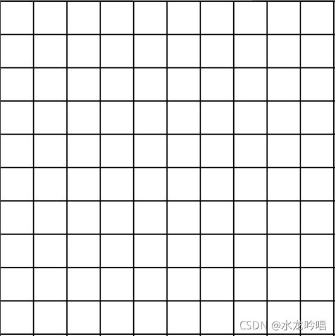 
抛100次之后，我们计算一下黑色格子的总面积，这个面积就是硬币正面朝上的概率。

####概率空间
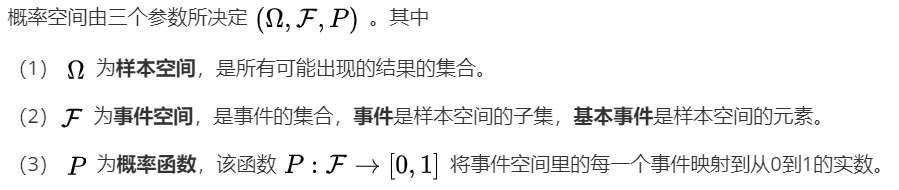 

如何理解概率空间的定义呢？

这里我们要引入平行世界，大家都看过《刺杀小说家》这部电影吧，里面就有平行世界的概念植入，有现实世界和小说世界嘛。（没看过的可以补一下，还是不错的）

这里我们用ω表示具体的一个世界，全部平行世界的集合用Ω表示。Ω的子集A的面积，我们用P(A)表示，所有平行性世界P(A) = 1，这是大前提。对于抛硬币问题，P（黑色格子面积）= 0.5。

这样我们就将不确定的概率问题转化为了确定的“区域与面积”的数据学问题。

####随机变量

从概率空间的角度看，随机变量只是Ω的函数。对于Ω中的各元素ω，函数f(ω)会返回相应的数值，这些数值就是随机变量。它与函数f(x) = x + 1类似，我们要先确定哪个世界，然后才能确定f(ω)。

我们可以用X(ω)表示随机变量：
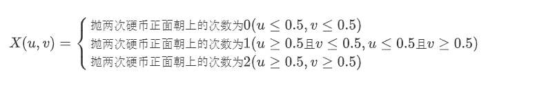 

左图是所有平行世界的集合，右图是随机变量X——（图比较渣，凑合看吧）
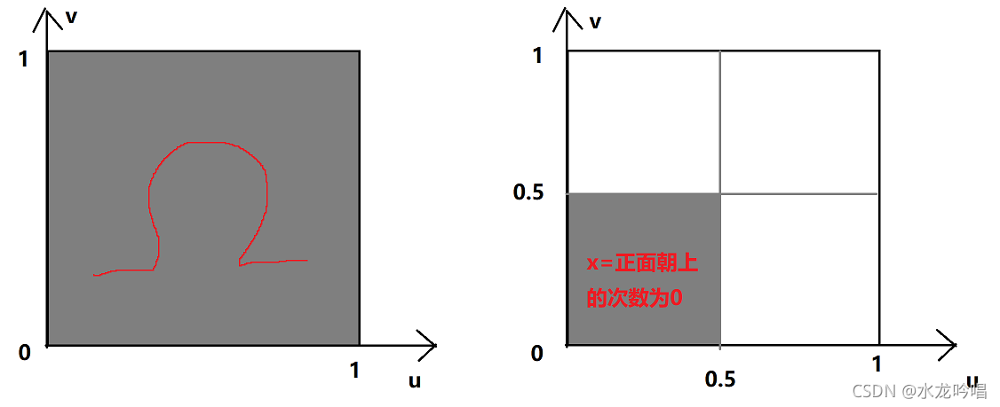 

由于X=抛两次硬币正面朝上的次数为0的面积为1/4，所以X有1/4的概率值为抛两次硬币正面朝上的次数为0。

####概率分布

概率分布就跟平行世界的概念没什么关系了，它只考虑面积。只要给出随机变量，我们就能计算出相应的概率分布，反过来并不成立哦。

比如我们抛硬币，只有正面朝上和反面朝上两种情况。那么求抛四次硬币，正面朝上的分布律和概率分布函数。

令随机变量X为硬币正面朝上的次数，X的概率密度（分布律）为：
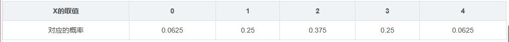 

概率分布函数（分布函数）为：

F(0) = P(X=0) = 0.0625

F(1) = P(X=0) + P(X=1) = 0.3125

F(2) = P(X=0) + P(X=1) + P(X=2) = 0.6875

F(3) = P(X=0) + P(X=1) + P(X=2) + P(X=3) = 0.9375

F(4) = P(X=0) + P(X=1) + P(X=2) + P(X=3) + P(X=4) = 1

python程序：
```python
import numpy as np
from scipy import stats
import matplotlib.pyplot as plt
from matplotlib.font_manager import FontProperties

#概率函数
def pf():
    xk = np.arange(5)  #[0,1,2,3,4]
    pk = (0.0625,0.25,0.375,0.25,0.0625) 
    custm = stats.rv_discrete(name='custm',values=(xk,pk))
    
    fig,ax = plt.subplots(1,1)
    ax.plot(xk, custm.pmf(xk),'go',ms=12,mec='g')
    ax.vlines(xk,0,custm.pmf(xk),colors='g',lw=4)
    for i in xk:
        ax.text(i,pk[i],pk[i],ha = 'center',va = 'bottom',fontsize = 12)
    plt.show()

#概率分布函数    
def pd_hist():
    xk = np.arange(5)  #[0,1,2,3,4]
    pk = (0.0625,0.25,0.375,0.25,0.0625) 
    custm = stats.rv_discrete(name='custm',values=(xk,pk))
    rv = custm.rvs(size=1000)
    
    pkf = custm.cdf(xk)
    fig,ax = plt.subplots(1,1)
    
    ax.hist(rv, 4, density=True, histtype='step',cumulative=True)
    
    for i in xk:
        ax.text(i,pkf[i],pkf[i],va = 'bottom',fontsize = 12)
    
pf()
pd_hist()
```

概率函数图：
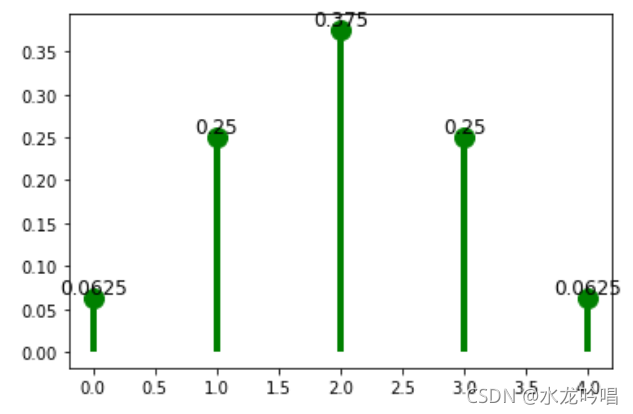 

概率分布函数图：
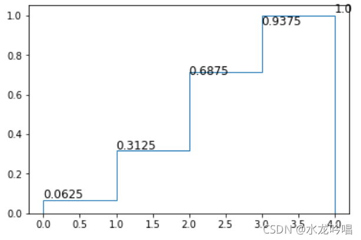 

####概率密度

可以简单理解为概率的密度（浓度）。浓度比较好理解，比如我们点一杯奶茶，有半糖、七分糖、全糖、多加糖，糖的浓度依次增加。

我们再往奶茶里加点珍珠，奶茶底部的珍珠多，奶茶上边的珍珠少。喝的时候把吸管往底部插一点，吸到的珍珠的概率就大。我们画一个珍珠的概率密度函数，可能是这样的：
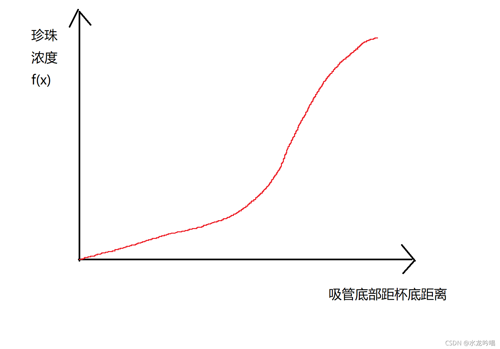 

所以概率密度函数f(x)的值越大， x附近的概率就越浓，即x附近的值有着更高的出现概率。

这里我们来画一下正态分布的概率密度函数，使用norm.pdf（）函数，该函数返回正态分布密度函数在x处的值。

python程序：
```python
import numpy as np
import scipy.stats as stats
import matplotlib.pyplot as plt
import matplotlib.style as style

plt.plot(np.linspace(-10,10,1000),stats.norm.pdf(np.linspace(-10,10,1000)))
plt.fill_between(np.linspace(-10,10,1000),stats.norm.pdf(np.linspace(-10,10,1000)))
```

输出：

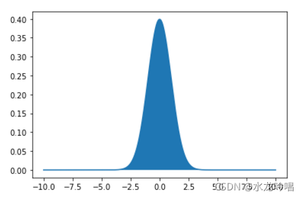 

常见的norm.cdf（）函数是norm.pdf（）的积分值，即累计分布函数。

python程序：
```python
import numpy as np
import scipy.stats as stats
import matplotlib.pyplot as plt
import matplotlib.style as style

plt.plot(np.linspace(-10,10,1000),stats.norm.cdf(np.linspace(-10,10,1000)))
plt.fill_between(np.linspace(-10,10,1000),stats.norm.cdf(np.linspace(-10,10,1000)))
```

输出：

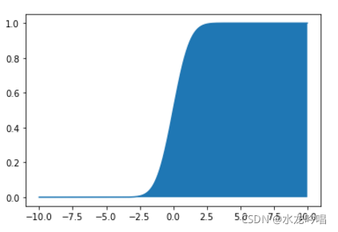 


####中心极限定理

到这里，相信大家对概率论中的一些概念要清晰很多了。最后我们用程序来验证一下中心极限定理。

中心极限定理告诉我们任何独立同分布的大量随机样本序列无论服从什么分别，其均值服从正态分布。

这里我们用均匀分布的随机变量来验证中心极限定理，假设有n个独立的随机变量，服从U[0,1]的均匀分布，则该均匀分布的期望为0.5，方差为1/12。根据中心极限定理，这些随机变量的均值分布应服从正态分布。

python程序：
```python
import numpy as np
import matplotlib.pyplot as plt
from scipy import stats
from math import sqrt

mean = 0.5   #随机变量均值为0.5
var = 1/12.0 #随机变量方差为1/12.0

#画出正态分布曲线
def norm(rv_num):   #rv_num为随机变量的个数
    norm_linspace = np.linspace(0,1,200)  
    norm_stats = stats.norm(mean,np.sqrt(var/rv_num))  #计算正态分布的方差
    norm_pdf = norm_stats.pdf(norm_linspace)
    plt.plot(norm_linspace,norm_pdf)   

#计算随机变量的均值
def uniform(rv_num):  
    uniform_sample = stats.uniform(loc = 0,scale = 1)
    sample_x = 0
    for i in range(rv_num):
         sample_x += uniform_sample.rvs() #rvs()产生服从指定分布的随机数
    return sample_x/rv_num

def his(rv_num,sample_num): #rv_num为随机变量的个数，sample_num为采样的次数
    x = np.zeros((sample_num))  
    for i in range(sample_num):  
        x[i] = uniform(sample_num)
    plt.hist(x,density=True) #绘制直方图
    norm(rv_num)
   
his(200,200)   # 随机变量的个数为200，采样次数为200
```
输出：

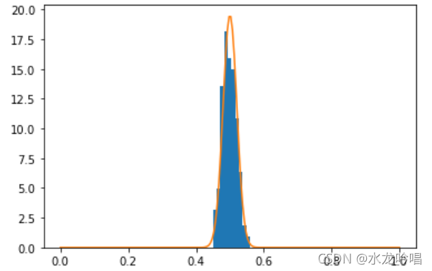 


从图中可以看出，均匀分布与正态分布基本吻合。


