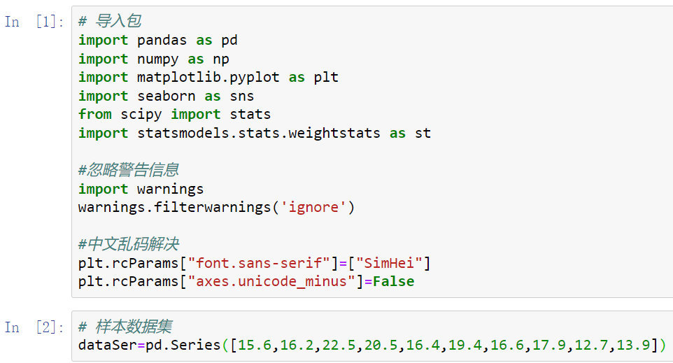
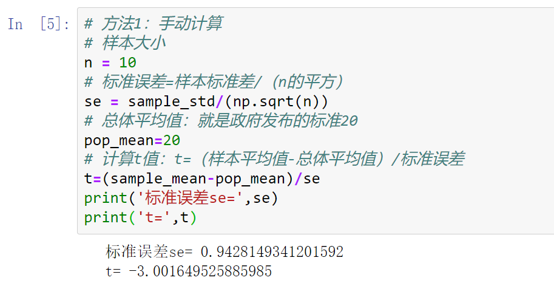

### **一、单样本检验--汽车引擎**

单样本检验的目的是检验单个样本的平均值是否等于目标值。超级引擎是一家专门生产汽车引擎的公司，根据政府发布的新排放要求，引擎排放平均值要低于20ppm。公司制造出10台引擎供测试使用，每一台的排放水平如下：

15.6 16.2 22.5 20.5 16.4 19.4 16.6 17.9 12.7 13.9

问题：如何判断公司生产的引擎是否满足新规定？

#### **（一）导入分析包，建立样本数据集**

```py
# 导入包
import pandas as pd
import numpy as np
import matplotlib.pyplot as plt
import seaborn as sns
from scipy import stats
import statsmodels.stats.weightstats as st

#忽略警告信息
import warnings
warnings.filterwarnings('ignore')

#中文乱码解决
plt.rcParams["font.sans-serif"]=["SimHei"]
plt.rcParams["axes.unicode_minus"]=False

# 样本数据集
dataSer=pd.Series([15.6,16.2,22.5,20.5,16.4,19.4,16.6,17.9,12.7,13.9])
```


#### **（二）查看样本描述统计性信息**
描述统计量是研究的核心，我们会在报告的第一部分进行描述统计分析，例如平均值和标准差。

```py
# 样本平均值
sample_mean=dataSer.mean()
# 样本标准差
sample_std=dataSer.std()
print('样本平均值=',sample_mean,'单位：ppm')
print('样本标准差=',sample_std,'单位：ppm')
```

#### **（三）假设检验**
##### **1、提出问题**

零假设：公司生产的引擎不满足新规定，也就是平均值u>=20

备选假设：公司生产的引擎满足新规定，也就是平均值u<20

检验类型：只有1个样本，属于单样本检验。

抽样分布类型：样本的数量为10，小于30，需要利用seaborn包来查看数据集的分布图来确定分布类型，从下图可以看出数据集的分布近似于正态分布，因此符合t分布。

> 在概率论和统计学中， t分布用于根据小样本来估计呈正态分布且方差未知的总体的均值。

```py
# 查看数据集分布
sns.distplot(dataSer)
plt.title('数据集分布')
plt.show()
```


检验方向：由于备选假设中包含小于号（<），所以我们使用单尾检验中的左尾检验。

综合以上分析，本次假设检验是单样本t检验，单尾检验中的左尾。
##### **2、找到证据**
在零假设成立前提下，我们需要得到样本平均值的概率p值。

计算p值步骤如下：

step1.计算出标准误差

标准误差=样本标准差除以样本大小n的开方。这里的样本标准差是用来估计总体标准差的

step2.计算t值

t=（样本平均值-总体平均值）/标准误差

step3.根据t值，自由度，计算出概率p值

```py
# 方法1：手动计算
# 样本大小
n = 10
# 标准误差=样本标准差/（n的平方）
se = sample_std/(np.sqrt(n))
# 总体平均值：就是政府发布的标准20
pop_mean=20
# 计算t值：t=（样本平均值-总体平均值）/标准误差
t=(sample_mean-pop_mean)/se
print('标准误差se=',se)
print('t=',t)
```


得出t值后，根据t表格找到对应的p值。

```py
# 方法2：用Python统计包scipy自动计算
# 总体平均值
pop_mean=20

'''
ttest_1samp：单独样本t检验
返回的第一个值t是假设检验计算出的（t值），
第2个值p是双尾检验的p值
'''
t,p_twoTail=stats.ttest_1samp(dataSer,pop_mean)
print('t值=',t,'双尾检验的p值=',p_twoTail)
```


```py
'''
scipy计算出的是双尾检验的t值和p值，我们这里是左尾检验，
根据对称性，双尾的p值是对应单尾p值的2倍
'''
# 单尾检验的p值
p_oneTail=p_twoTail/2
print('单尾检验的p值=',p_oneTail)
```

##### **3、判断标准**
```py
# 判断标准（显著水平）使用alpha=5%
alpha=0.05
```
##### **4、做出结论**
APA格式是美国心理学会给出了如何撰写研究论文的完整指南，其中一部分告诉我们如何写出推论统计学结果，我们使用APA格式来报告假设检验的结果。

在报告假设检验时，需要告诉读者以下几点信息：

1）给出检验类型：是单尾检验还是双尾检验。

2）给出p值：同样保留两位小数，然后输出逗号。

3）给出检验方向：例如是单尾检验还是双尾检验。

4）显著性水平：始终让读者知道你在做出决策时使用的显著性水平。

```py
'''
左尾判断条件：t < 0 and p < 判断标准（显著水平）alpha
右尾判断条件：t > 0 and p < 判断标准（显著水平）alpha
'''
# 做出结论
if(t<0 and p_oneTail<alpha):
    # 左尾判断条件
    print('拒绝零假设，有统计显著，也就是汽车引擎排放满足标准')
else:
    print('接受零假设，没有统计显著，也就是汽车引擎排放不满足标准')
```


结论：单样本检验t(9)=-3.00 , p=.0074 (α=5%),单尾检验（左尾）
#### **（四）置信区间**
下面的网站可计算t值95%的置信水平，自由度是n-1（9）对应的t值为2.2622。
https://www.graphpad.com/quickcalcs/statratio1/


```py
'''
1）置信水平对应的t值（t_ci）
查t表格可以得到，95%的置信水平，自由度是n-1对应的t值
2）计算上下限
置信区间上限a=样本平均值 - t_ci ×标准误差
置信区间下限b=样本平均值 + t_ci ×标准误差
'''

# 求置信区间（a,b）
t_ci=2.2622
# 使用scipy计算标准误差
se=stats.sem(dataSer)
# 置信区间上限
a=sample_mean-t_ci * se
# 置信区间下限
b=sample_mean+t_ci * se
print('单个平均值的置信区间，95置信水平CI=(%f,%f)'%(a,b))
```


说明：t_ci是置信水平的t值，是根据置信水平95%从t表格里查找到的t值 ，为了和前面的t值区别，所以加了后缀t_ci。
#### **（五）效应量**
效应量是指处理效应的大小，效应量太小，意味着处理即使达到了显著水平，也缺乏实用价值。因此在假设检验中，我们既要给出是否具有统计显著性，也要给出效应量，综合来判断研究结果是否有意义。

效应量报告格式：d=x.xx ，R2=.xx
```py
'''
效应量：差异指标Cohen's d
'''
d=(sample_mean - pop_mean)/sample_std

'''
效应量：相关度指标R2
'''
#样本大小
n=10
#自由度
df=n-1
R2=(t*t)/(t*t+df)

print('d=',d)
print('R2=',R2)
```

#### **（六）数据分析报告**
1、描述统计分析

样本平均值17.17ppm，样本标准差2.98ppm

2、推论统计分析

1）假设检验

单样本检验t(9)=-3.00,p=.0074(α=5%)，单尾检验（左尾）

统计上存在显著差异，拒绝零假设，公司引擎排放满足新标准

2）置信区间

平均值的置信区间，95% CI=(15.04,19.30)

3）效应量

d=-0.95，效果显著

### **二、相关配对检验--斯特鲁普效应**
斯特鲁普效应在心理学中指干扰因素对反应时间的影响。例如当测试者被要求说出某个颜色和其覆盖的文字字面意义不符的词语时，被测者往往会反应速度下降，出错率上升。下面的链接可以用来测试：
https://faculty.washington.edu/chudler/java/ready.html

<div style="text-align:center; color:rgba(0, 0, 0, 0.5);">
字体颜色与字体内容一致
</div>


<div style="text-align:center; color:rgba(0, 0, 0, 0.5);">
字体颜色与字体内容不一致
</div>

我们进入测试页面可以得到两组有颜色的文字，第一组数据是字体内容和字体颜色一致，第二组数据是字体内容和字体颜色不一致。我们分别对每组文字说出文字的颜色，并分别统计完成每组的时间。

你应该感觉到，读第一组文字的颜色非常容易，并且读的快，而读第二组文字的颜色就没那么容易了，读的时间明显慢很多，这就是著名的斯特鲁普效应。
#### **（一）导入分析包，建立样本数据集**
```py
# 导入包
import pandas as pd
import numpy as np
import matplotlib.pyplot as plt
import seaborn as sns
from scipy import stats
import statsmodels.stats.weightstats as st

#忽略警告信息
import warnings
warnings.filterwarnings('ignore')

#中文乱码解决
plt.rcParams["font.sans-serif"]=["SimHei"]
plt.rcParams["axes.unicode_minus"]=False

# 导入样本数据集
data = pd.read_csv('stroopdata.csv',encoding = 'GBK')
data.head()
```

#### **（二）查看样本描述统计性信息**

```py
# 获取描述统计信息
data.describe()
```


查看信息一致与不一致的反应时间对比图：

```py
'''
第一组数据：字体内容和字体颜色一致情况下，实验者的反应时间
'''
# 第一组数据均值
con1_mean = data['Congruent'].mean()
# 第一组数据标准差
con1_std = data['Congruent'].std()

'''
第一组数据：字体内容和字体颜色不一致情况下，实验者的反应时间
'''
# 第二组数据均值
con2_mean = data['Incongruent'].mean()
# 第二组数据标准差
con2_std = data['Incongruent'].mean()
# 画板
fg = plt.figure(figsize=(20,10))
# 画纸
ax = fg.add_subplot(1,1,1)
# 绘制柱状图
data.plot(kind='bar',ax = ax)
#显示图形
plt.show()
```


不难发现“不一致”情况下所用时间均大于“一致”情况，也就是当字体内容和字体颜色不一致时，测试者的平均反应时间变长。接下来我们就对斯特鲁普效应进行假设验证。
#### **（三）假设验证**
##### 1、提出问题

（定义第一组“一致”反应时间的均值为t1，第二组“不一致”反应时间的均值为t2）

零假设H0：斯特鲁普效应不存在，也就是t1=t2

备选假设H1：斯特鲁普效应存在，也就是t1<t2

检验类型：因为使用的两组数据是相关样本，所以是相关配对检验。

抽样分布类型：样本的数量为25，小于30，相关配对检验只关注每对相关数据的差值，所以我们利用seaborn包来查看差值数据集的分布图来确定分布类型，从下图可以看出数据集的分布近似于正态分布，因此符合t分布。

先增加‘差值’列：

```py
# 差值数据集
data['差值'] = data['Congruent']-data['Incongruent']
data.head()
```


差值数据集分布图：

```py
# 导入绘图包
import seaborn as sns
# 查看数据集分布
sns.distplot(data['差值'])
plt.title('差值数据集分布')
plt.show()
```


检验方向：由于备选假设中包含小于号（<），所以我们使用单尾检验中的左尾检验。
##### 2、找到证据

在零假设成立前提下，我们需要得到样本平均值的概率p值。

```py
# 导入统计模块（stats）
from scipy import stats

'''
ttest_rel:相关配对检验
返回的第1个值t是假设检验计算出的（t值），
第2个值p是双尾检验的p值
'''
t,p_twoTail = stats.ttest_rel(data['Congruent'],data['Incongruent'])
print('t值=',t,'双尾检验的p值=',p_twoTail)
```


```py
# 单尾检验的p值
p_oneTail=p_twoTail/2
print('单尾检验的p值',p_oneTail)
```

##### 3、判断标准

```py
# 判断标准（显著水平）使用alpha=5%
alpha=0.05
```

##### 4、做出结论
```py
# 判断标准（显著水平）使用alpha=5%
alpha=0.05

'''
根据对称性，双尾的p值是对应单尾p值的2倍
左尾判断条件：t < 0 and p/2 < alpha
右尾判断条件：t > 0 and p/2 < alpha
'''
# 单尾检验的p值
p_oneTail=p_twoTail/2
# 显著水平
a=0.05
# 决策
if(t<0 and p_oneTail < a):
    print('拒绝零假设，有统计显著')
    print('也就是接受备选假设：特鲁普效应存在')
else:
    print('接受备选假设，没有统计显著，也就是特鲁普效应不存在')
```

#### **（四）置信区间**
95%的置信水平，自由度是n-1（24）对应的t值为2.0639。

```py
'''
查找t表格获取
95%的置信水平，自由度是n-1对应的t值
'''
t_ci=2.0639
# 差值数据集平均值
sample_mean=data['差值'].mean()
# 使用scipy计算标准误差
se=stats.sem(data['差值'])
# 置信区间上限
a=sample_mean-t_ci * se
# 置信区间下限
b=sample_mean+t_ci * se
print('两个平均值差值的置信区间，95置信水平CI=(%f,%f)'%(a,b))
```

#### **（五）效应量**
```py
'''
效应量：差异指标Cohen's d
'''
# 差值数据集对应的总体平均值是0
pop_mean=0
# 差值数据集的标准差
sample_std=data['差值'].std()
d=(sample_mean-pop_mean)/sample_std
print('d=',d)
```

#### **（六）数据分析报告**

1、描述统计分析

第一组（一致）反映时间平均值：13.98s，标准差：3.48s；

第二组（不一致）反映时间平均值：22.92s，标准差：5.66s；

2、推论统计分析

1）假设检验

相关配对检验t(24)=-7.97,p=3.37e-08(α=5%)，单尾检验（左尾）

统计上存在显著差异，拒绝零假设，斯特鲁普效应存在

2）置信区间

95% CI=(-11.24,-6.62)

3）效应量

d=-1.63，效果显著
### **三、独立双样本检验--A/B测试**
A/B 测试是一种产品优化的方法，为同一个优化目标制定两个方案（比如两个手机键盘界面），让一部分用户使用A 方案（称为控制组或对照组），同时另一部分用户使用 B 方案（称为变化组或试验组），统计并对比不同方案的各项指标，以判断不同方案的优劣并进行决策。

问题：有两款键盘布局不一样的手机(A版本，B版本)，你作为公司的产品经理，想在正式发布产品之前知道，哪个键盘布局对用户体验更好呢？


我们将衡量标准定为用户打字时拼错字产生的影响，如果一个键盘布局对用户打字时拼错产生的影响较小，那么这个布局是符合用户使用习惯的。

采集数据：我们随机抽取实验者，将实验者分成2组，每组25人，A组使用键盘布局A，B组使用键盘布局B。让他们在30秒内打出标准的20个单词文字消息，然后记录每组打错字的数量。
#### **（一）导入分析包，建立样本数据集**

```py
# 导入包
import pandas as pd
import numpy as np
import matplotlib.pyplot as plt
import seaborn as sns
from scipy import stats
import statsmodels.stats.weightstats as st

#忽略警告信息
import warnings
warnings.filterwarnings('ignore')

#中文乱码解决
plt.rcParams["font.sans-serif"]=["SimHei"]
plt.rcParams["axes.unicode_minus"]=False

# 文件路径
fileNameStr='键盘AB测试.xlsx'
# 读取Excel数据：统一先按照字符串读入，之后转换
xls=pd.ExcelFile(fileNameStr)
data=xls.parse('Sheet1')
data.head()
```

#### **（二）查看样本描述统计性信息**

```py
# 获取描述统计信息
data.describe()
```


可以看到，A版本的平均打错字数为5.08 低于B版本的平均打错字数为7.80。
#### **（三）假设验证**
##### 1、提出问题
零假设H0：A版本和B版本没有差别，也就是A版本平均值=B版本平均值。

备选假设H1：A版本和B版本有差别，也就是A版本平均值不等于B版本平均值。

检验类型：因为这里是两组不同的人来测试2组独立版本，所以是双独立样本检验。

抽样分布类型：样本的数量为25，小于30，需要利用seaborn包来查看数据集的分布图来确定分布类型，从下图可以看出AB版数据集的分布均近似于正态分布，因此符合t分布。

```py
import seaborn as sns

# 查看数据集分布
sns.distplot(data['A'])
plt.title('A版本数据集分布')
plt.show()

sns.distplot(data['B'])
plt.title('B版本数据集分布')
plt.show()
```


检验方向：由于备选假设中包含不等号，所以我们使用双尾检验。
##### 2、找到证据

在零假设成立前提下，我们需要得到样本平均值的概率p值。

```py
import statsmodels.stats.weightstats as st

'''
ttest_ind：独立双样本t检验，
usevar='unequal'两个总体方差不一样
返回的第1个值t是检验计算出的（t值），
第2个p_two是双尾检验的p值
第3个df是独立双样本的自由度
'''
t,p_two,df=st.ttest_ind(data['A'],data['B'],usevar='unequal')
print('t=',t,'p_two=',p_two,'df=',df)
```

##### 3、判断标准
```py
# 判断标准（显著水平）使用alpha=5%
alpha=0.05
```
##### 4、做出结论
```py
# 做出结论
if(p_two<alpha/2):
    print('拒绝零假设，有统计显著，也就是接受备选假设')
    print('备选假设：A版本和B版本有差异')
else:
    print('接受零假设，没有统计显著')
    print('零假设：A版本和B版本没有差异')
```

#### **（四）置信区间**
95%的置信水平，自由度是n-1（24）对应的t值为2.0639。
```py
'''
查找t表格获取
95%的置信水平，自由度是n-1对应的t值
'''
# 求置信区间（a,b）
t_ci=2.0639

# 合并标准差
a_mean=data['A'].mean()
a_std=data['A'].std()
b_mean=data['B'].mean()
b_std=data['B'].std()

#样本大小
a_n=25
b_n=25

# 使用scipy计算标准误差
se=np.sqrt(np.square(a_std)/a_n + np.square(b_std)/b_n)

'''
对于双独立样本检验
置信区间的样本平均值=A版本平均值-B版本平均值
'''
sample_mean=a_mean-b_mean
# 置信区间上限
a=sample_mean-t_ci * se
# 置信区间下限
b=sample_mean+t_ci * se
print('两个平均值差值的置信区间，95置信水平CI=(%f,%f)'%(a,b))
```

#### **（五）效应量**
```py
# 合并标准差
sp=np.sqrt((a_n-1)*np.square(a_std)+(b_n-1)*np.square(b_std))/np.sqrt(a_n+b_n-2)
# 效应量Cohen's d
d=(a_mean-b_mean)/sp
print('d=',d)
```


#### **（六）数据分析报告**
1、描述统计分析

A版本打错字数量平均：5.08个，标准差：2.06个；

B版本打错字数量平均：7.80个，标准差：2.65个；

2、推论统计分析

1）假设检验

独立双样本检验t(25)=-4.06,p=0.00019(α=5%)，双尾检验

统计上存在显著差异，拒绝零假设，A版本和B版本有差异

2）置信区间

95% CI=(-4.10,-1.34)

3）效应量

d=-1.15，效果显著